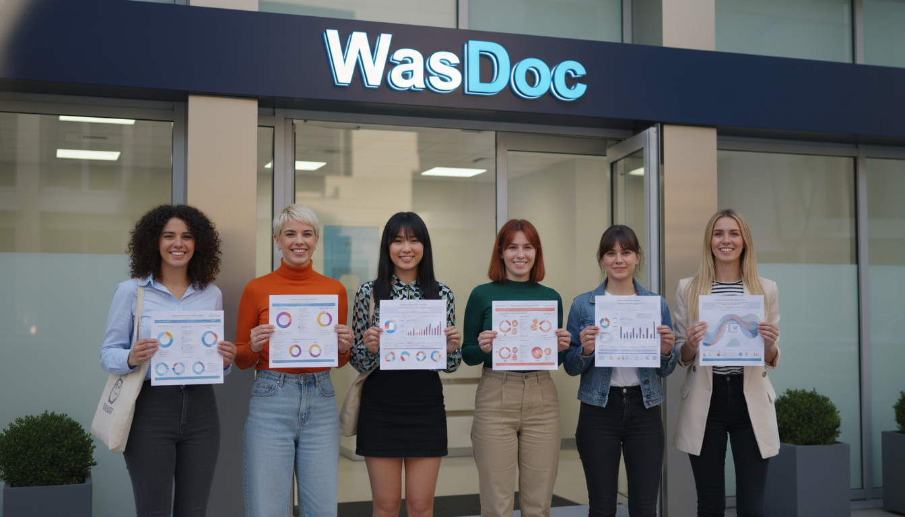

  

# WasDoc: The Future of ATS-Verified Infographic Resumes 🚀

### "Stop choosing between a resume humans love and a resume bots can read."

**WasDoc** resolves the **Visual vs. Parseable Paradox**. We empower candidates to stand out with high-impact, infographic-style resumes that are **99% readable by Applicant Tracking Systems (ATS)** using our proprietary dual-layer technology.

---

<h2>🧩 Industry Overview: Hiring Architecture</h2>

<table>
  <tr>
    <td width="33%" valign="top">
      <h3>1) ATS Market</h3>
      
Ingests resumes and runs parsing, scoring, and routing.

    </td>
    <td width="33%" valign="top">
      <h3>2) Talent Intelligence</h3>
      
Turns candidate profiles into searchable, rankable data.

    </td>
    <td width="33%" valign="top">
      <h3>3) Resume Tools</h3>
      
Where resumes are created, edited, formatted, and branded.

    </td>
  </tr>
</table>

---

<h2>✅ WasDoc = The Verification Layer</h2>

<strong>WasDoc is the verification layer for modern hiring.</strong> 
We ensure your data is accurate and your resume is readable by both <strong>ATS</strong> and <strong>humans</strong>.

<blockquote>
Without verification, the entire pipeline is partially blind 
like hiring through fog while the best candidates are trying to be seen.
</blockquote>

---

## 🛠️ The Tech Behind the Win 
We provide an enterprise-grade intelligence layer that ensures your career story is never lost in a machine's extraction error.
  
| Feature | What It Does for You |
| :--- | :--- |
| **Dual-Layer PDF** | A high-quality visual layer for human recruiters + an invisible transcript layer for ATS bots. |
| **Deep Verification** | (99% parsing accuracy) and O*Net/SOC occupation taxonomy consistency. |
| **Talent Intelligence** | Extracts structured skills with confidence scores to match you with the right roles. |
| **ATS Matrix** | Rigorously tested against Greenhouse, Workable, iCIMS, and Lever. |

---

## 💎 Choose Your Service Tier

| Plan | Best For... | Investment |
| :--- | :--- | :--- |
| **ATS Resume Audit** | Candidates with an existing resume who need guaranteed parsing. | **$39** |
| **ATS-Verified Infographic** | High-level professionals wanting a custom-designed, visual edge. | **$99** |

*All plans include a full verification audit and the embedded ATS transcript layer.*

---

## 🔗 Connect with Us 

Stay updated with the latest in career tech and resume optimization strategies.

---

## 💼 Business Opportunities

### Enterprise Talent Intelligence
Are you a recruiting platform or enterprise looking to verify candidate authenticity at scale? Our API provides verified skills extraction and parsing optimisation for any type of Resume.

[Contact Sales →](mailto:hello@wasdoc.com)

### Join the Sales Agent Program
Earn a **10% recurring commission** by helping candidates stand out. Join our network of Sales Agents and gain access to your own performance dashboard.

[Become a Partner →](mailto:hello@wasdoc.com)

---

  Built with ❤️ for the future of talent.  
  <strong>WasDoc.com</strong>

